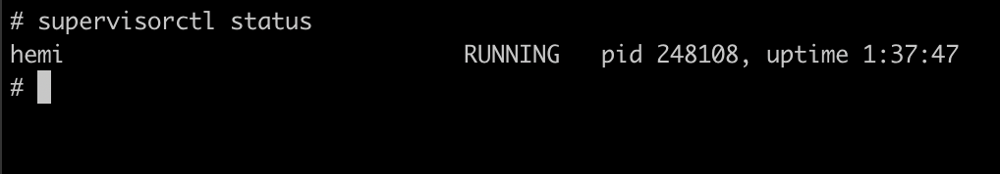
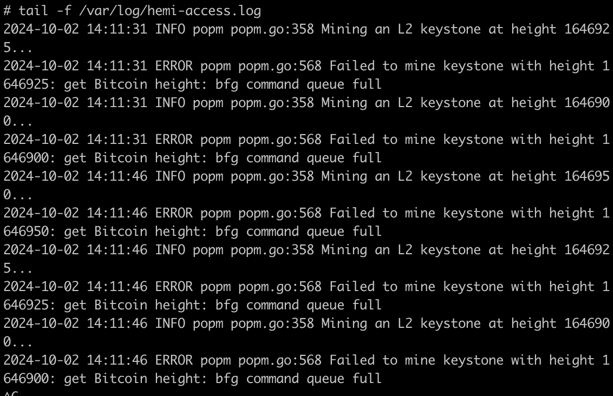

## **Install Hemi CLI PopMiner** 

## Download and Setup the Hemi Network Binary
#### 1. sudo su && cd /root
#### 2. wget https://github.com/hemilabs/heminetwork/releases/download/v0.4.3/heminetwork_v0.4.3_linux_amd64.tar.gz
#### 3. Create a Directory for Hemi
#### 4. mkdir hemi
#### 5. Extract the Downloaded Archive
```sh
tar --strip-components=1 -xzvf heminetwork_v0.4.3_linux_amd64.tar.gz -C hemi
```
source: https://github.com/ademulyanaDEV/hemi-miner/blob/main/hemi-minerv0.4.3.md

# Install supervisord for Debian based/ubuntu

##### 1. sudo apt update - y && sudo apt install supervisor -y
##### 2. nano /etc/supervisor/conf.d/hemi.conf
##### config of hemi.conf
####
```
[program:hemi]
environment=POPM_BTC_PRIVKEY=your_private_key,POPM_STATIC_FEE=160,POPM_BFG_URL=wss://testnet.rpc.hemi.network/v1/ws/public
directory=/root/hemi/
command=/root/hemi/popmd
user=root
process_name=%(program_name)s
autostart=true
autorestart=true
redirect_stderr=false
stdout_logfile=/var/log/hemi-access.log
stdout_logfile_maxbytes=1MB
stdout_logfile_backups=10
stdout_capture_maxbytes=1MB
stdout_events_enabled=false
stderr_logfile=/var/log/hemi-error.log
stderr_logfile_maxbytes=1MB
stderr_logfile_backups=10
```
### after you save the config, run commands below

### update config

```
supervisorctl update
```
### Restart the service 
```
supervisorctl restart hemi
```
### check status with
```
supervisorctl status
```



### The command below is to view the logs
```
tail -f /var/log/hemi-access.log
```

